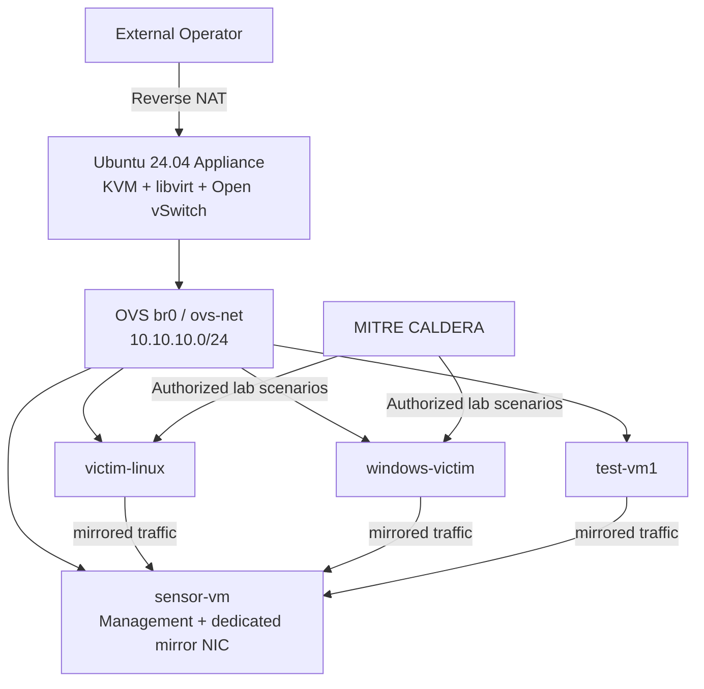

<h1 align="center">XDR Lab Appliance</h1>

<p align="center">
  <strong>KVM + Open vSwitch 기반의 Self-contained XDR / NDR Security Lab.</strong>
</p>

<p align="center">
  Sensor, Linux/Windows victim, traffic mirroring, reverse NAT, snapshot, scenario workflow를 하나의 Appliance CLI로 운영합니다.
</p>

<p align="center">
  <a href="README.md">English</a> · <strong>한국어</strong> ·
  <a href="https://xdr.ooo/products/xdr-lab-appliance">XDR Lab Appliance</a> ·
  <a href="https://xdr.ooo/products/stellar-appliance-cli">Stellar Appliance CLI</a>
</p>

<p align="center">
  
  
  
  
</p>

<p align="center">
  <strong>제품 페이지:</strong>
  <a href="https://xdr.ooo/products/xdr-lab-appliance">XDR Lab Appliance</a> ·
  <a href="https://xdr.ooo/products/stellar-appliance-cli">Stellar Appliance CLI</a>
</p>

---

## 하나의 Appliance에서 전체 Security Lab을 구성합니다

XDR Lab Appliance는 Ubuntu 24.04 host 하나를 반복 구축 가능한 XDR/NDR Lab으로 만듭니다.

Host는 KVM/libvirt와 Open vSwitch를 사용하며 `aella_cli` 하나로 VM lifecycle, traffic mirror, reverse NAT, snapshot, runtime validation, scenario orchestration을 관리합니다.

## Core Lab

| Component | 역할 |
|---|---|
| **sensor-vm** | Stellar Cyber Modular Data Sensor / mirrored traffic observer |
| **victim-linux** | Ubuntu 24.04 attack target / pivot |
| **windows-victim** | Windows EDR / behavior test endpoint |
| **test-vm1** | 임시 Linux scenario VM |
| **br0 / ovs-net** | 10.10.10.0/24 lab L2 segment |
| **aella_cli** | Appliance와 Lab의 canonical operator interface |

## Architecture



Sensor capture NIC는 별도의 mirror sink이며 management traffic과 capture traffic을 분리합니다.

## 주요 기능

| 영역 | 기능 |
|---|---|
| **VM Lifecycle** | Deploy, start, stop, destroy, inspect, rebuild |
| **Linux Provisioning** | Cloud-init 기반 Ubuntu victim |
| **Windows Provisioning** | Prepared qcow2 Windows |
| **Traffic Visibility** | OVS port mirror → Sensor capture NIC |
| **External Access** | Deterministic reverse-NAT |
| **Snapshots** | create / revert / list / delete |
| **Scenario Orchestration** | 승인된 Lab의 MITRE CALDERA 연동 |
| **Validation** | Host/network/runtime readiness와 reboot persistence |
| **Single CLI** | `aella_cli appliance ...`, `aella_cli lab ...` |

## 빠른 시작

```bash
cd /home/aella/xdr-lab-appliance
source config/paths.sh

sudo bash installer/cli-installer.sh
sudo /opt/xdr-lab/xdr-lab.sh
```

OVS network를 최초 한 번 정의합니다.

```bash
sudo virsh net-define config/ovs-net.xml
sudo virsh net-start ovs-net
sudo virsh net-autostart ovs-net
```

Lab 배포:

```bash
aella_cli lab deploy all --dry-run
aella_cli lab deploy all
aella_cli lab status all
```

## 제품 문서

- **XDR Lab Appliance:** https://xdr.ooo/products/xdr-lab-appliance
- **Stellar Appliance CLI:** https://xdr.ooo/products/stellar-appliance-cli
- 전체 architecture, NAT/OVS, CALDERA, runbook, recovery reference: [README.md](README.md)

Attack simulation 기능은 격리된 Lab 또는 사용자가 소유하거나 명시적으로 테스트 권한을 받은 환경에서만 사용합니다.

## License

MIT License. 자세한 조건은 [LICENSE](LICENSE)를 확인합니다.

---

<p align="center">
  <strong>Build the lab. Mirror the traffic. Reproduce the scenario.</strong>
</p>
