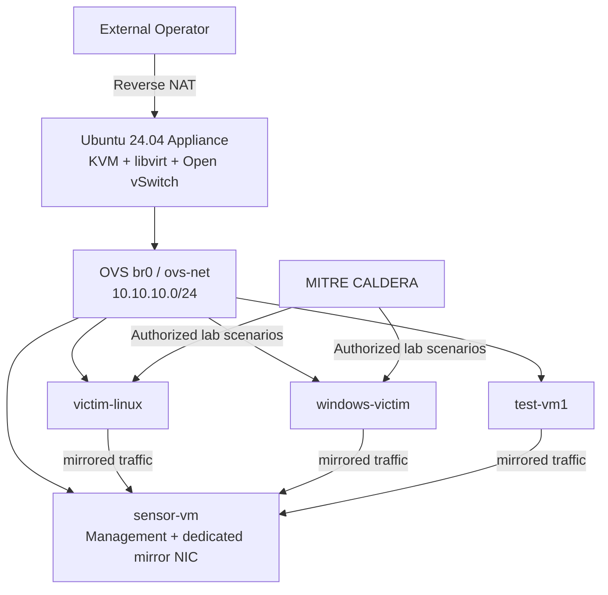

<h1 align="center">XDR Lab Appliance</h1>

<p align="center">
  <strong>A self-contained XDR / NDR security lab built on KVM + Open vSwitch.</strong>
</p>

<p align="center">
  Deploy a sensor, Linux and Windows victims, controlled network mirroring, reverse NAT, snapshots, and repeatable attack-simulation workflows from one appliance CLI.
</p>

<p align="center">
  <strong>English</strong> · <a href="README.ko.md">한국어</a> ·
  <a href="https://xdr.ooo/products/xdr-lab-appliance">XDR Lab Appliance</a> ·
  <a href="https://xdr.ooo/products/stellar-appliance-cli">Stellar Appliance CLI</a>
</p>

<p align="center">
  
  
  
  
</p>

<p align="center">
  <strong>Product pages:</strong>
  <a href="https://xdr.ooo/products/xdr-lab-appliance">XDR Lab Appliance</a> ·
  <a href="https://xdr.ooo/products/stellar-appliance-cli">Stellar Appliance CLI</a>
</p>

---

## Build the whole security lab as an appliance

XDR Lab Appliance turns one Ubuntu 24.04 host into a reproducible XDR/NDR lab.

The host runs KVM/libvirt and Open vSwitch. A single operator CLI, `aella_cli`, manages lab VMs, network mirroring, reverse-NAT access, snapshots, runtime validation, and scenario orchestration.

## Core lab

| Component | Role |
|---|---|
| **sensor-vm** | Stellar Cyber Modular Data Sensor and mirrored-traffic observer |
| **victim-linux** | Ubuntu 24.04 attack target / pivot host |
| **windows-victim** | Windows endpoint for EDR / behavioral testing |
| **test-vm1** | Disposable Linux VM for ad-hoc scenarios |
| **br0 / ovs-net** | Shared 10.10.10.0/24 lab L2 segment |
| **aella_cli** | Canonical operator interface for appliance and lab workflows |

## Architecture



The sensor capture interface is a dedicated mirror sink. Management and capture traffic are intentionally separated.

## What the appliance provides

| Area | Capability |
|---|---|
| **VM lifecycle** | Deploy, start, stop, destroy, inspect and rebuild lab VMs |
| **Linux provisioning** | Cloud-init based Ubuntu victim deployment |
| **Windows provisioning** | Prepared qcow2 Windows deployment |
| **Traffic visibility** | Open vSwitch port mirroring to the Sensor capture NIC |
| **External access** | Deterministic reverse-NAT port mapping for operator access |
| **Snapshots** | VM snapshot create/revert/list/delete workflows |
| **Scenario orchestration** | MITRE CALDERA integration for controlled lab exercises |
| **Validation** | Host/network/runtime readiness and post-reboot verification |
| **Single CLI** | `aella_cli appliance ...` and `aella_cli lab ...` |

## Quick start

Clone or enter the repository:

```bash
git clone https://github.com/xdr-labs/xdr-lab-appliance.git
cd xdr-lab-appliance
source config/paths.sh

sudo bash installer/cli-installer.sh
sudo /opt/xdr-lab/xdr-lab.sh
```

Define and start the OVS network once:

```bash
sudo virsh net-define config/ovs-net.xml
sudo virsh net-start ovs-net
sudo virsh net-autostart ovs-net
```

Preview, deploy, and inspect the lab:

```bash
aella_cli lab deploy all --dry-run
aella_cli lab deploy all
aella_cli lab status all
```

For the product-facing guides:

- **XDR Lab Appliance:** https://xdr.ooo/products/xdr-lab-appliance
- **Stellar Appliance CLI:** https://xdr.ooo/products/stellar-appliance-cli

> Attack-simulation functions are intended only for isolated systems and environments you own or are explicitly authorized to test.

---

## Requirements

For a reduced lab footprint, the historical floor is approximately **4 vCPU / 16 GiB RAM / 200 GiB thin-provisioned disk**.

For all four declared VMs running together, plan for approximately:

- **12+ vCPU**
- **24–32 GiB RAM**
- sufficient disk headroom above the declared guest allocation, especially when using snapshots
- Ubuntu 24.04, KVM/libvirt, and Open vSwitch
- nested virtualization and permissive vSwitch/port-group settings when the appliance itself runs as a nested VM

See [Deployment Readiness](docs/deployment-readiness.md) for current sizing and topology details.

## Canonical VM names

The current configuration uses:

```text
sensor-vm
victim-linux
windows-victim
test-vm1
```

Use these names in CLI commands and operational documentation.

## Documentation

Detailed operational material is maintained under `docs/` instead of being duplicated in this README.

| Topic | Document |
|---|---|
| Access and credentials | [docs/access.md](docs/access.md) |
| Deployment sizing/readiness | [docs/deployment-readiness.md](docs/deployment-readiness.md) |
| Operational validation | [docs/operational-validation.md](docs/operational-validation.md) |
| Troubleshooting | [docs/troubleshooting.md](docs/troubleshooting.md) |
| Runtime recovery | [docs/operational-recovery.md](docs/operational-recovery.md) |
| Runtime maintenance | [docs/operational-maintenance.md](docs/operational-maintenance.md) |
| CALDERA integration | [docs/caldera-integration.md](docs/caldera-integration.md) |
| Live-run playbook | [docs/live-run-playbook.md](docs/live-run-playbook.md) |

The repository root is the source tree. Runtime paths should follow the configured `${XDR_ROOT}` / `${XDR_BASE}` values rather than a developer-specific home directory.

> Attack-simulation functions are intended only for isolated systems and environments you own or are explicitly authorized to test.

## License

MIT License. See [LICENSE](LICENSE).

---

<p align="center">
  <strong>Build the lab. Mirror the traffic. Reproduce the scenario.</strong>
</p>
